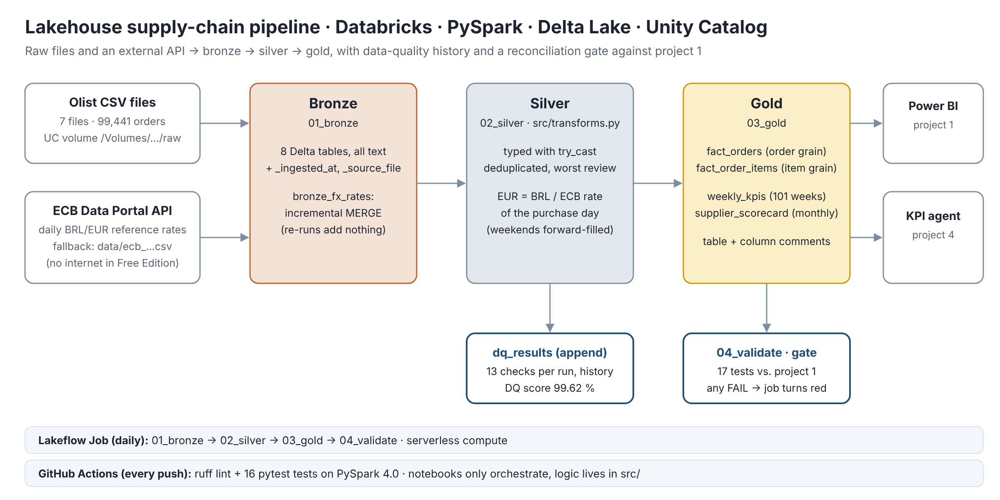
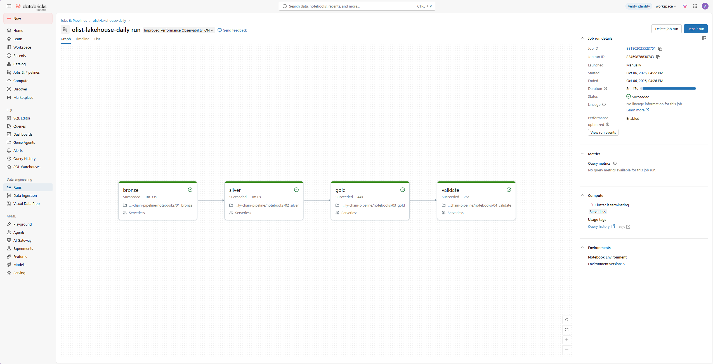
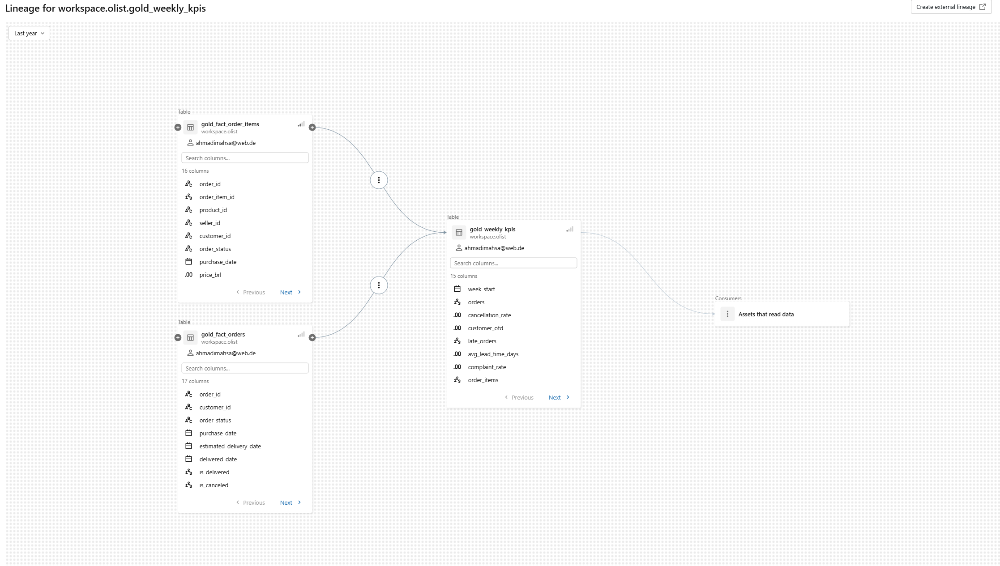

# Lakehouse-Pipeline für Lieferkettendaten (Databricks · PySpark · Delta Lake)

[English](README.md) · **Deutsch**

> Eine tägliche, getestete und dokumentierte Pipeline von Rohdateien und einer externen API bis zu KPI-Tabellen – auf den Cent abgeglichen mit einer zweiten, unabhängigen Umsetzung.

## Ausgangslage
Berichte sind nur so gut wie die Pipeline dahinter. Kommen Daten aus mehreren Quellen mit unterschiedlicher Qualität, braucht es einen Prozess, der sie jeden Tag automatisch bereinigt, umrechnet und prüft – und stoppt, bevor falsche Zahlen im Bericht landen. Dieses Projekt baut das Datenmodell aus [Projekt 1](https://github.com/Mahsa93-lab/supplier-delivery-performance-powerbi) (SQL Server + Power BI) als Lakehouse-Pipeline nach, ergänzt die Umrechnung in EUR mit offiziellen EZB-Kursen und speichert die Historie jeder Datenqualitätsprüfung.

## Wichtigste Ergebnisse
1. **Zwei Umsetzungen, identische Zahlen:** SQL Server (Projekt 1) und Databricks liefern dieselben 99.441 Bestellungen, 13.591.643,70 BRL Umsatz, 6.535 verspätete Bestellungen, 10.423 verspätete Übergaben und 4.542 Datenqualitätsbefunde. Ein Quality Gate mit 17 Tests bricht den Job ab, sobald eine Zahl abweicht.
2. **Die Währung verdeckt 37 Prozentpunkte Wachstum:** Der Umsatz Jan–Aug 2018 gegenüber 2017 wuchs **in BRL um 137 %, in EUR nur um 100 %** – der Real schwächte sich im Mittel von 3,51 auf 4,24 BRL pro EUR ab. Ein europäisches Management würde die BRL-Zahl falsch lesen.
3. **Wiederholte Läufe sind sicher:** Wechselkurse werden inkrementell per `MERGE` geladen; ein zweiter Lauf fügt nichts hinzu, Datenqualitätsergebnisse werden als Historie angehängt.

## Daten
- [Olist Brazilian E-Commerce](https://www.kaggle.com/datasets/olistbr/brazilian-ecommerce) (Kaggle, CC BY-NC-SA 4.0) – 7 CSV-Dateien in einem Unity-Catalog-Volume
- [EZB-Datenportal](https://data.ecb.europa.eu/) – tägliche Referenzkurse BRL/EUR, Serie `EXR.D.BRL.EUR.SP00.A`. Die Databricks Free Edition beschränkt den Internetzugang, deshalb nutzt das Notebook ersatzweise `data/ecb_brl_eur_2016_2018.csv`, erzeugt mit `python src/ecb_ingest.py`

## Architektur (Medallion)
| Schicht | Tabellen | Was passiert |
|---|---|---|
| Bronze | `bronze_*` (8) | Rohkopie, alle Spalten als Text, `_ingested_at`, `_source_file`; Wechselkurse inkrementell per `MERGE` |
| Silver | `silver_*` (7) | typisiert mit `try_cast` (kein Abbruch bei fehlerhaften Werten), dedupliziert, schlechteste Bewertung je Bestellung, EUR mit dem EZB-Kurs des Kauftags |
| Gold | `gold_fact_orders`, `gold_fact_order_items`, `gold_weekly_kpis`, `gold_supplier_scorecard` | zwei Granularitäten wie in Projekt 1; Wochen- und Monats-KPIs für Power BI und den KI-Agenten (Projekt 4) |
| Qualität | `dq_results`, `04_validate` | 13 Prüfungen je Lauf als Historie (DQ-Score 99,62 %); Abgleich-Gate mit 17 Tests |

## Engineering-Praktiken
- **Logik in getesteten Funktionen, Notebooks orchestrieren nur:** `src/transforms.py` und `src/dq_checks.py` sind reine PySpark-Funktionen (DataFrame rein, DataFrame raus)
- **16 Unit-Tests** (`pytest`) sichern jede Geschäftsregel mit kleinen, selbst gebauten Daten ab – z. B. „Wochenendkäufe nutzen den Kurs vom Freitag“, „Bestellungen ohne Positionen bleiben in der Bestellfaktentabelle“, „Bearbeitungszeit ist NULL, wenn die Übergabe vor der Freigabe liegt“
- **CI mit GitHub Actions:** `ruff` + `pytest` auf PySpark 4.0 bei jedem Push
- **Lakeflow Job** mit vier Tasks auf Serverless Compute, täglich geplant
- **Governance:** Tabellen- und Spaltenkommentare in Unity Catalog, Lineage im Catalog Explorer sichtbar

## Ergebnisse
| Kennzahl | Wert |
|---|---|
| Gelesene Zeilen je Lauf | 446.873 (7 Dateien) + 767 EZB-Tage |
| Geschriebene Tabellen | 8 Bronze · 7 Silver · 4 Gold · 1 DQ-Historie |
| Datenqualitätsprüfungen je Lauf | 13 (4.542 Befunde, DQ-Score 99,62 %) |
| Quality Gate | 17 / 17 PASS |
| Unit-Tests | 16 / 16 PASS |
| Laufzeit des täglichen Jobs | 3 min 47 s auf Serverless (Bronze 1:33 · Silver 1:00 · Gold 0:44 · Validate 0:26) |

## Screenshots
| Täglicher Job: vier Tasks, alle grün | Lineage in Unity Catalog |
|---|---|
|  |  |

Tabellen- und Spaltenkommentare im Catalog Explorer: [images/03_table_docs.png](images/03_table_docs.png)

## Ausführen
1. Kostenloses Konto anlegen: [Databricks Free Edition](https://www.databricks.com/learn/free-edition)
2. Workspace → **Create → Git folder** → dieses Repository klonen
3. `notebooks/01_bronze` einmal ausführen (legt Schema und Volume an) → die 7 Olist-CSVs nach `/Volumes/workspace/olist/raw` hochladen → erneut ausführen
4. `02_silver` → `03_gold` → `04_validate` ausführen (oder einen Job mit vier Tasks anlegen)
5. Lokale Tests (Linux/macOS oder CI; Java 17 nötig): `pip install -r requirements.txt pyspark==4.0.*` → `pytest`

Erwartete Werte für jeden Schritt: [docs/expected-results.md](docs/expected-results.md)

## Bezug zu meiner Erfahrung
Bei BMW habe ich Daten aus vier Bereichen – zwei Fachbereiche und zwei lieferantenseitige Quellen – in eine zentrale Reportinglösung zusammengeführt und die Datenqualität mit den datenliefernden Bereichen abgestimmt. Dieses Projekt zeigt denselben Anspruch technisch umgesetzt: jede Quelle nachvollziehbar, jede Prüfung mit Historie, und kein Bericht ohne bestandenes Quality Gate.

## Nächste Schritte
- Bestellungen inkrementell per `MERGE` statt vollständigem Überschreiben (Change Data Feed)
- Alarm, wenn sich eine DQ-Prüfung gegenüber dem letzten Lauf verschlechtert – der KPI-Agent in Projekt 4 liest `dq_results`
- Job als Code mit Databricks Asset Bundles ausrollen

## Portfolio
Vier zusammenhängende Projekte zu vertrauenswürdigen Daten und KI in der Supply Chain – vom Dashboard über die Pipeline bis zum Agenten:

| # | Projekt | Fragestellung | Stack |
|---|---|---|---|
| 1 | [Lieferanten- & Lieferperformance](https://github.com/Mahsa93-lab/supplier-delivery-performance-powerbi) | Welche Lieferanten verursachen Verspätungen – und was kosten sie an Reklamationen? | SQL Server · Power BI · DAX |
| 2 | **Lakehouse-Pipeline Supply Chain** *(dieses Repository)* | Lassen sich dieselben Kennzahlen täglich, automatisch und hinter einem Datenqualitäts-Gate erzeugen? | Databricks · PySpark · Delta Lake |
| 3 | [Assistent EU AI Act & DSGVO](https://github.com/Mahsa93-lab/eu-ai-act-rag-assistant) | Kann ein KI-Assistent Rechtsfragen mit überprüfbaren Quellen beantworten? | RAG · OpenAI · FastAPI · Docker |
| 4 | [KI-Agent für KPI-Wochenberichte](https://github.com/Mahsa93-lab/ai-kpi-reporting-agent) | Kann ein KI-Agent die wöchentliche Management-Summary schreiben – ohne eine einzige ungeprüfte Zahl? | n8n · MCP · SPC · Docker |

Die Projekte bauen aufeinander auf: Projekt 2 liefert dieselben Zahlen wie Projekt 1 auf den Cent genau (99.441 Bestellungen, 13.591.643,70 BRL Umsatz); der Agent in Projekt 4 liest die Gold-Tabellen aus Projekt 2 und nutzt die Such-API aus Projekt 3.

---
*Autorin: Mahsa Ahmadi · Ausschließlich öffentliche Daten; es wurden keine unternehmensinternen Daten verwendet.*
